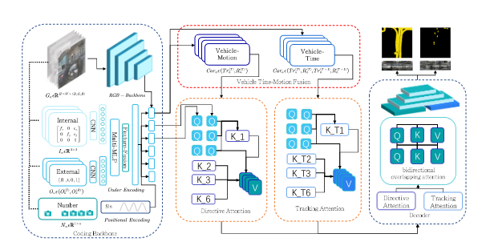

# <div align="center">**UIF-BEV**</div>


This repository contains the source code and data for our paper:

> [**UIF-BEV: An underlying information fusion framework for bird’s-eye-view semantic segmentation**]

<div align="center"></div>


## <div align="center">**Installation**</div>

```bash
# Clone repo
git clone https://github.com/LeningWang

cd UIF-BEV

# Setup conda environment
conda create -y --name uifbev python=3.8

conda activate uifbev
conda install -y pytorch torchvision cudatoolkit=11.3 -c pytorch

# Install dependencies
pip install -r requirements.txt
pip install -e .
```

## <div align="center">**Data**</div>


Documentation:
* [Dataset setup](docs/dataset_setup.md)
* [Label generation](docs/label_generation.md) (optional)

<br/>

Download the original datasets and our generated map-view labels

| | Dataset | Labels |

| nuScenes | [keyframes + map expansion](https://www.nuscenes.org/nuscenes#download) (60 GB) 

<br/>

The structure of the extracted data should look like the following

```
/datasets/
├─ nuscenes/
│  ├─ v1.0-trainval/
│  ├─ v1.0-mini/
│  ├─ samples/
│  ├─ sweeps/
│  └─ maps/
│     ├─ basemap/
│     └─ expansion/
└─ labels_nuscenes/
   ├─ scene-0001/
   ├─ scene-0001.json
   ├─ ...
   ├─ scene-1000/
   └─ scene-1000.json
```

When everything is setup correctly, check out the dataset with

```bash
python3 scripts/view_data.py \
  data=nuscenes \
  data.dataset_dir=/media/ln/Data/NUSCENES/datasets/nuscenes \
  data.labels_dir=/media/ln/Data/NUSCENES/datasets/labels_nuscenes \
  data.version=v1.0-trainval \
  visualization=nuscenes_viz \
  +split=val
```

# <div align="center">**Training**</div>


<br>


To train a model,

```bash
python3 scripts/train.py \
  +experiment=cvt_nuscenes_vehicle
  data.dataset_dir=/media/ln/Data/NUSCENES/datasets/nuscenes \
  data.labels_dir=/media/ln/Data/NUSCENES/datasets/labels_nuscenes
```

For more information, see

* `config/config.yaml` - base config
* `config/model/uif.yaml` - model architecture
* `config/experiment/nuscenes_vehicle.yaml` - additional overrides

## <div align="center">**Additional Information**</div>

### **Awesome Related Repos**

* https://github.com/bradyz/cross_view_transformers


